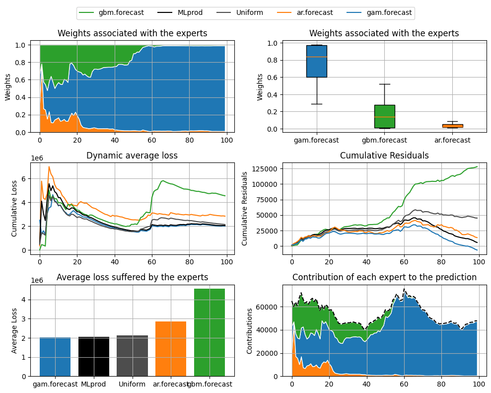

OPERA
================

-   [Setting: when is the package `opera`
    useful?](#setting-when-is-the-package-opera-useful)
-   [Installation](#installation)
-   [Example: predict the weekly electricity
    consumption.](#example-predict-the-weekly-electricity-consumption)

<!-- badges: start -->

<!-- badges: end -->

`opera` is a python package that provides several algorithms to perform
robust online prediction of time series with the help of expert advice.
In this vignette, we provide an example of how to use the package.

## Setting: when is the package `opera` useful?

Consider a sequence of real bounded observations
*y*<sub>1</sub>, …, *y*<sub>*n*</sub> to be predicted step by step.
Suppose that you have at your disposal a finite set of methods
*k* = 1, …, *K* (henceforth referred to as experts) that provide you
before each time step *t* = 1, …, *n* predictions *x*<sub>*k*, *t*</sub>
of the next observation *y*<sub>*t*</sub>. You can form your prediction
*ŷ*<sub>*t*</sub> by using only the knowledge of the past observations
*y*<sub>1</sub>, …, *y*<sub>*t* − 1</sub> and past and current expert
forecasts *x*<sub>*k*, 1</sub>, …, *x*<sub>*k*, *t*</sub> for
*k* = 1, …, *K*. The package <a href=#>opera</a> implements several
algorithms of the online learning literature that form predictions
*ŷ*<sub>*t*</sub> by combining the expert forecasts according to their
past performance. That is,

<p align="center">

</p>

These algorithms come with finite time worst-case guarantees. The
monograph of [Cesa-Bianchi and Lugisi
(2006)](https://ii.uni.wroc.pl/~lukstafi/pmwiki/uploads/AGT/Prediction_Learning_and_Games.pdf)
gives a complete introduction to the setting of prediction of arbitrary
sequences with the help of expert advice.

### What are the most important functions?

The package `opera` provides the `mixture` class to
build the algorithm object. The class contain three important functions:
1. `update` to update the class with new experts and new y.
2. `predict` to make a prediction by using the algorithm. 
3. `plot_mixture` to provide different diagnostic plots for an aggregation procedure.

## Installation

opera is not available on pypi, in order to install it you need to run the following command 
in the root directory:

``` py
pip install .
```


## Example: predict the weekly electricity consumption.

Here, we provide a concrete example on how to use the package. The data are 
provided in the folder data.

The dataset contains three experts in experts.csv and the corresponding targets in targets.csv.

More information about the dataset can be found [here](https://github.com/Dralliag/opera#example-predict-the-weekly-electricity-consumption).

### Load the datasets
``` py
import pandas as pd
targets = pd.read_csv("data/targets.csv")["x"]
experts = pd.read_csv("data/experts.csv")
```
### Aggregate the experts online using one of the possible aggregation procedures

The first step consists in initializing the algorithm by defining the type of algorithm (BOA, MLpol,…), 
the experts and targets, the possible parameters, and the evaluation criterion. 
Bellow, we define the ML-Poly algorithm, evaluated by the square loss.

``` py
from opera import Mixture
MLPOL1 = Mixture(
    y=targets.iloc[0:100],
    experts=experts.iloc[0:100],
    model="MLpol",
    loss_type="mse",
    loss_gradient=False,
)
```

The results can be displayed with method `plot_mixture`.


``` py
MLPOL1.plot_mixture()
```



The same results can also be obtained by initializing the mixture with some data and updating it later:


``` py
MLPOL2 = Mixture(
    y=targets.iloc[0:50],
    experts=experts.iloc[0:50],
    awake=awake[0:50],
    model=model,
    loss_type="mse",
    loss_gradient=False,
)

MLPOL2.update(
    new_experts=experts.iloc[50:100], new_y=targets.iloc[50:100], awake=awake[50:100]
)
```


### About the predictions

The vector of predictions formed by the mixture can be obtained through
the output prediction.

``` py
predictions = MLPOL1.predictions
```

Note that these predictions were obtained sequentially by the algorithm
by updating the model coefficients after each data. It is worth to
emphasize that each observation is used to get the prediction of the
next observations but not itself (nor past observations).

In real-world situations, predictions should be produced without having
access to the observed outputs. There are two solutions to get them
with `opera`.

Using the `predict` method : the model coefficients are not updated during 
the prediction. 

``` py
newexperts = experts.iloc[-10:] # last ten observations of the dataset 
pred = MLPOL1.predict(new_experts = newexperts)
print(pred)

# array([[53308.36828688],
#        [57099.33148933],
#        [56767.62097983],
#        [55611.67204501],
#        [57256.02185278],
#        [61655.81982573],
#        [65022.29207561],
#        [72666.72935961],
#        [68171.64429055],
#        [60642.5452753 ]])
```

   
The same result can be easily obtained by using the last model
coefficients to perform the weighted sum of the expert advice.

``` py
import numpy as np
pred = np.sum(newexperts * MLPOL1.w, axis=1)
print(pred)
# array([[53308.36828688],
#        [57099.33148933],
#        [56767.62097983],
#        [55611.67204501],
#        [57256.02185278],
#        [61655.81982573],
#        [65022.29207561],
#        [72666.72935961],
#        [68171.64429055],
#        [60642.5452753 ]])
```

